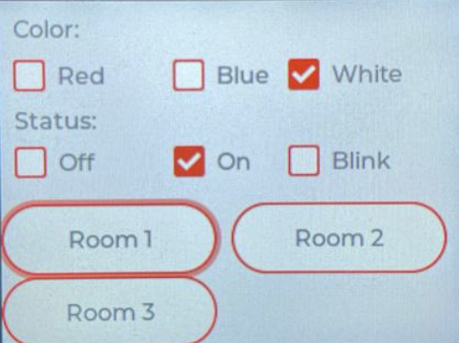
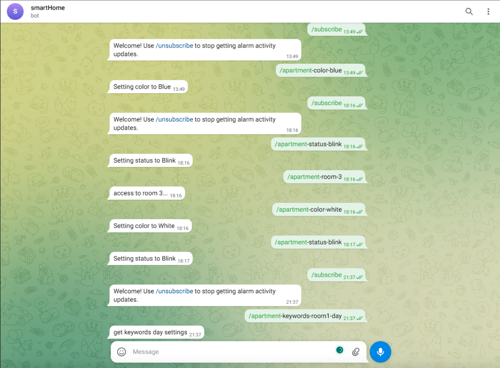
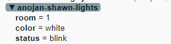

# Modul 242 - Smart Home
If you want to start with "smarthome" this is a perfect way to start modernizing your house. 
This guide will show how to change the colors of a LED strip using a telegramm-bot and a micro controller.
Since we didn't have a house available, we built a small house out of cardboard as a demo and divided it by different rooms. 
For the room we have chosen to have three rooms with the names room1, room2 and room3
This way we can simulate the whole thing.

## What can the program do?
- Set light color and mode via Telegram-Bot or micro controller for each room
- Set color white, red and blue including blinking and party mode, which is a mix of colors
- Telegram-Bot recognizes key-words such as **sleep** for confortable colors to sleep, **day** for bright colors and **party** for fancy colors

There is also a tutorial on how to use this program. The tutorial video is linked to this repository or you can contact the owners of the project (references in the "authors" chapter)

## Getting started
First of all, you need to clone the repository. For this you need Git installed on your computer. [Click here to download Git](https://git-scm.com/downloads)    
Once Git is installed on your device, open a terminal and paste the following command:
```
git clone https://github.com/shawn-lacarta/m242-smart-home.git
```
Now open Visual Studio Code and download the **PlatformIO IDE** extension. Once you see an alien on your sidebar on Visual Studio Code, you are ready to go.


### Control the LED-Stripe with a micro controller
Once the program is started with **Upload and Monitor**, you will find a GUI on the m5Stack.  
  
Here you can easily change the color and the room of the light. Also you can choose which room  your changes should apply on. You will shortly notice that your changes will be immidiately be applied on the LED-Stripe.  

### Control the LED-Stripe via Telegram-Bot
First of all you need a Telegram account. You can easily do this with you mobile number. Once you have a account, you can search up for the **BotFather**. Enter the chat and type **/start**. The next step is to enter **/newbot**. After that the bot will ask you to name your new bot. Once you entered your name for your new bot, a new chat will be generated and you will see the chat on your recent chats. You will also see a **generated token** to access the HTTP API. You will need to add this to the **config.properties** file under **telegram-apikey**. Once added, you can start up the main function. Now you can write messenges to the server like this:  
  
Your changes will reflect on the MQTT-Server, which will apply your changes to the micro controller (LED-Stripes).  
  

## Authors
- Shawn Lacarta
- Anojan Pirabakaran
